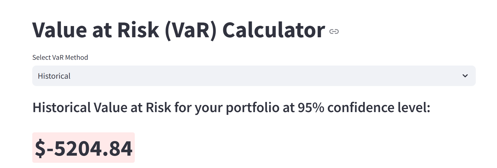
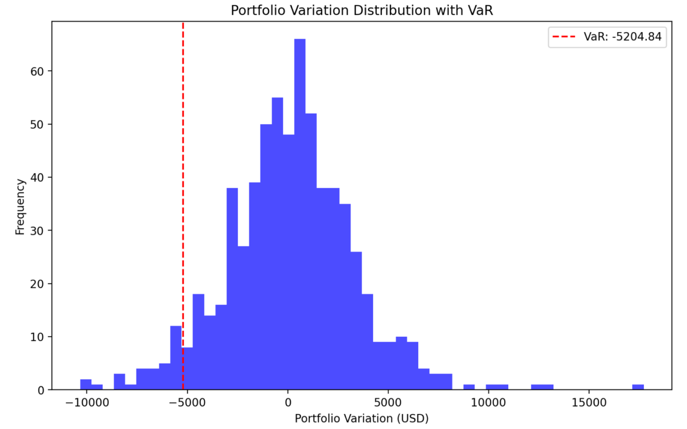
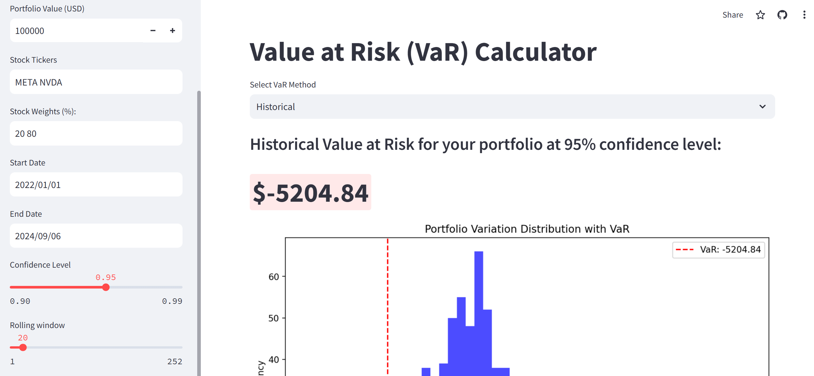

# Value at Risk App
This web application calculates the Value at Risk (VaR) for user portfolios using Historical, Parametric, and Monte Carlo methods. Users can input their portfolio details, including stock tickers, weights, and time periods. The application not only provides the VaR value for each method but also displays the distribution of portfolio gains and losses, helping users assess potential risks in their investments.

[Value at Risk Calculation Web App](https://portfoliovar.streamlit.app/)

## Features
- VaR calculation
- Histogram of the portfolio variation for each VaR method

## Technologies Used
- **Python**: Implement the logic for the VaR calculation
- **Streamlit**: User interface

## Demo






## Relevant Code

### Historical VaR function
```python
def historical_var(portfolio_returns, confidence_level, portfolio_value):
    losses = portfolio_returns * portfolio_value 
    var = np.percentile(losses, 100 * (1 - confidence_level))
    return var, losses
```
### Parametric VaR function
```python
def parametric_var(portfolio_returns, confidence_level, portfolio_value):
    mean = np.mean(portfolio_returns)
    sigma = np.std(portfolio_returns)
    z_score = norm.ppf(1 - confidence_level)
    var = (mean + z_score * sigma) * portfolio_value
    losses = portfolio_returns * portfolio_value
    return var, losses
```
### Monte Carlo VaR function
```python
def monte_carlo_var_cov(simulations, mean_returns, cov_matrix, weights, portfolio_value, confidence_level):
    simulated_returns = np.random.multivariate_normal(mean_returns, cov_matrix, simulations)
    portfolio_simulated_returns = np.dot(simulated_returns, weights)
    losses = portfolio_value * portfolio_simulated_returns
    var = np.percentile(losses, 100 * (1 - confidence_level))
    return var, losses
```